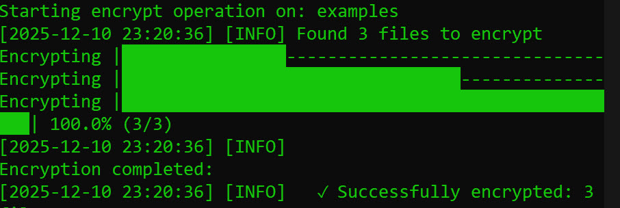
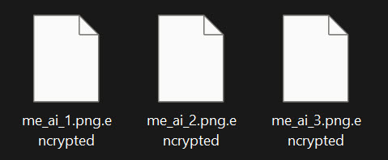
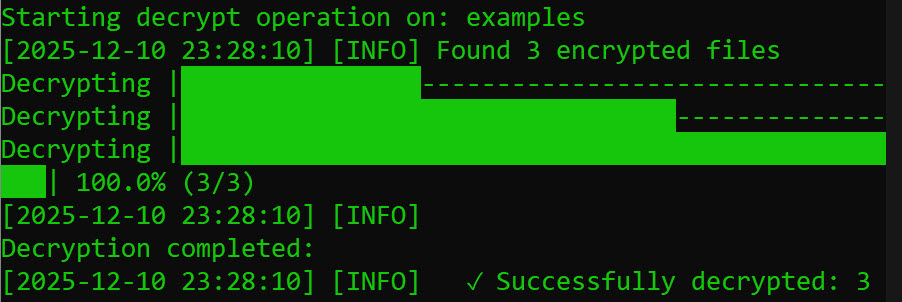

# 🔐 AES File Encryption Tool

A professional, secure, and efficient file encryption utility using AES-256-CBC encryption algorithm.

## ✨ Features

- 🔒 **AES-256-CBC Encryption** - Military-grade encryption
- 🔑 **PBKDF2 Key Derivation** - Secure password-based key generation
- 📁 **Recursive Directory Processing** - Encrypt entire folder structures
- 🎯 **File Exclusion Patterns** - Skip specific files/patterns
- 📊 **Progress Tracking** - Real-time progress bars
- 📝 **Comprehensive Logging** - Detailed operation logs
## 📸 Screenshots

<div align="center">
<p>My files:</p>

<p>My Lets encrypt !</p>

  <p>Encrypted files</p>

  <p>Decrypt files</p>

</div>
## 🔧 Installation

```bash
# Install dependencies
pip install -r requirements.txt
```

## 📖 Usage

### Encrypt Directory

```bash
python main.py encrypt /path/to/directory
```

### Decrypt Directory

```bash
python main.py decrypt /path/to/directory
```

### Encrypt with Exclusions

```bash
python main.py encrypt /path/to/directory --exclude "*.log" "*.tmp"
```

## 🧪 Testing

```bash
python -m unittest discover tests
```

## ⚠️ Security Warnings

- **Never lose your password** - Files cannot be recovered without it
- **Use strong passwords** - Minimum 12 characters recommended
- **Backup important data** - Always keep backups before encryption

